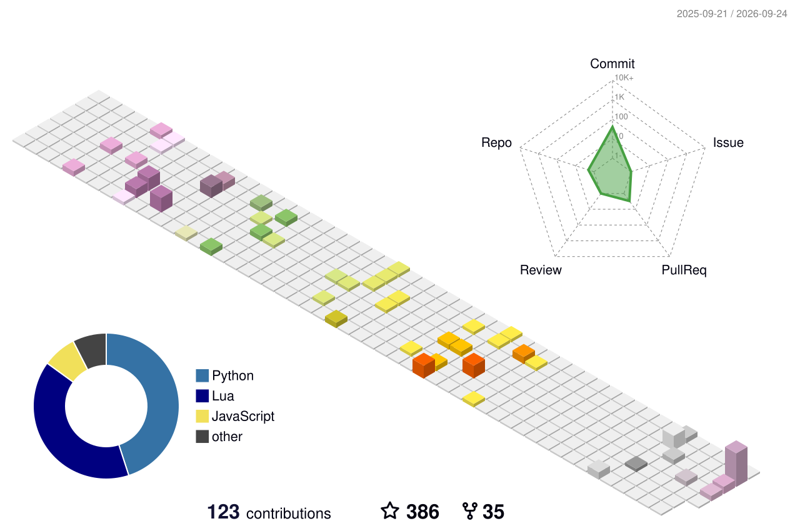

### Hola , soy sonder

Soy `Chang Lu` aka `Sonder`  

`Coffee` y `Tennis` me interesan. Puedes ver mi sitio web de blog personal en [https://space.keter.host](https://space.keter.host). He registrado la mayor parte de lo que he aprendido en mi blog.

Soy:

- Un estudiante de posgrado mediocre.
- Interesado en computación de alto rendimiento.
- ~~Alguien centrado en técnicas de aprendizaje profundo para Visión por Computadora.~~
- Poco versado en Latex.
- Usando Python & C++.
- Intentando convertirme en ingeniero senior.

Ojalá todos tengamos un futuro brillante. (｡•̀ᴗ-)✧.

Correo electrónico: changlu@keter.host

Mis sitios web de interés:

- Notas del Blog: [https://space.keter.host](https://space.keter.host)
- Guía para principiantes de CUDA: [https://cuda.keter.host](https://cuda.keter.host)
- Mi Panel de PR: [https://pr-dashboard.keter.host](https://pr-dashboard.keter.host/)

Mis repositorios de GitHub a los que contribuyo:

  
